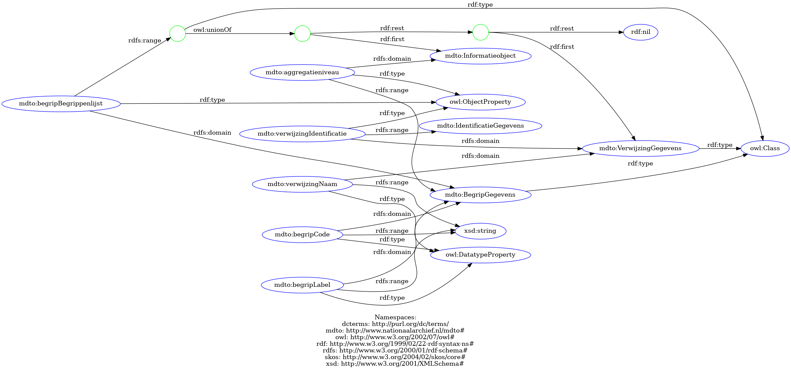
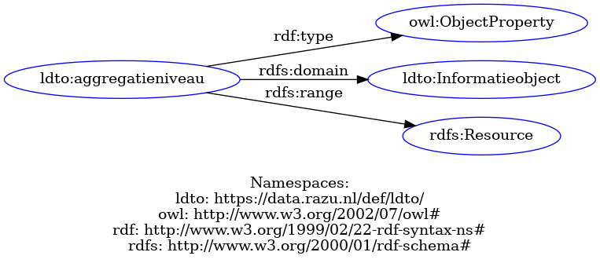

## Directory index

- **ldto.ttl**: The formal declaration of the core LDTO ontology.
- **ldto.html**: HTML view of the ontology following [LODE](https://essepuntato.it/lode/) [here](https://regionaal-archief-zuid-utrecht.github.io/ldto/def/ldto.html)
- **LDTO-MDTO-mapping.xlsx**: Mapping between LDTO and MDTO properties, detailing the differences and the rationale behind LDTO choices.

## Further MDTO-LDTO mapping explainations

One of the main changes in LDTO is the use of entities URIs instead of using the mdto:GegevensGroep class. This nested structure of MDTO, which finds at the end string datatypes, is well designed for XML but results overly complicated in RDF: linked data has a graph structure and thrives when other resources on the web identified via URI are linked together. For this reason, RAZU manages thesauri of entities (actors, locations, etc.) and for which itmints URIs that can link to further descriptions of the entity. Moreover, following the linked data open word principle, when possible, we link to other data sources that describe the same entity (ex: geonames for places or wikidata).

for example, this is how the information "an Information Object has aggregation level 'some aggregation level controlled terminology' is formalized in MDTO:

whereas in LDTO, we can link to a URI in a RAZU thesauri and formalize it like this:

## How to update the html version when ldto.ttl is modified:

1. install pylode: `pip install pylode`
2. If you are using language tags, you need to modify the code to take that into account since pylode does not support multilinguality.
2. in this directory, run: `python3 -m pylode.cli ldto.ttl -o ldto.html`

